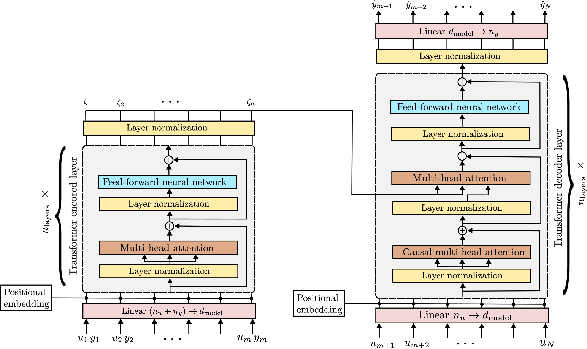

# In-context learning for model-free system identification

This repository contains the Python code to reproduce the results of the paper [On the adaptation of in-context learners for system identification](http://arxiv.org/abs/2308.13380)
by Dario Piga, Filippo Pura and Marco Forgione.


## Abstract
In-context  system identification  aims at constructing meta-models to describe classes of systems, differently from traditional approaches that model  single systems. This paradigm facilitates the leveraging of knowledge acquired from observing the behaviour of different, yet related dynamics. This paper discusses  the role of meta-model adaptation. Through numerical examples, we demonstrate how meta-model adaptation can enhance predictive performance in three realistic scenarios: tailoring the meta-model to describe a specific system rather than a class; extending the meta-model to capture the behaviour of systems beyond the initial training class; and recalibrating the model for new prediction tasks. Results highlight the effectiveness of meta-model adaptation to achieve a more robust and versatile meta-learning framework for system identification.

## Architecture

The meta-model for n-step-ahead simulation is an encoder-decoder Transformer:

<!--  -->


# Experiments:
The examples discussed in the paper and available in the repository illustrate:
 * Meta-generalization (without adaptation) from different data distributions
 * Adaptation from system class to system within the class
 * Adaptation from system class to system out of the class
 * Adaptation from 100-step-ahead to 1000-step-ahead simulation

# Results
## Adaptation from 100 to 1000 simulation steps
* Training a 1000-step-ahead simulation meta-model from scratch does not seem to be work (orange curve)
* Training a 100-step-ahead simulation meta-model from scratch is feasible (blue curve), as also shown in one of our [previous works](https://github.com/forgi86/sysid-transformers)
* Training a 1000-step-ahead meta-model initializing the optimization from weights of the 100-step case works (green curve)!
  


# Software requirements
Experiments were performed on a Python 3.11 environment with:

 * numpy
 * scipy
 * matplotlib
 * pytorch (v2.1.0)
 
In a conda environment, these dependencies may be installed with the commands:

```
conda install numpy scipy matplotlib
conda install pytorch -c pytorch
```


# Hardware requirements
While the scripts can run on CPU, execution may be frustratingly slow. For faster training, a GPU is highly recommended.
We used a server equipped with an Nvidia RTX 3090 GPU.

<!--

# Citing

If you find this project useful, we encourage you to:

* Star this repository :star: 


* Cite the [paper](https://arxiv.org/abs/2206.12928) 
```
@article{forgione2023a,
  title=In-context learning for model-free system identification},
  author={Forgione, M. and Pura, F. and Piga, D.},
  journal={arXiv preprint arXiv:2308.13380},
  year={2022}
} 
```
-->
